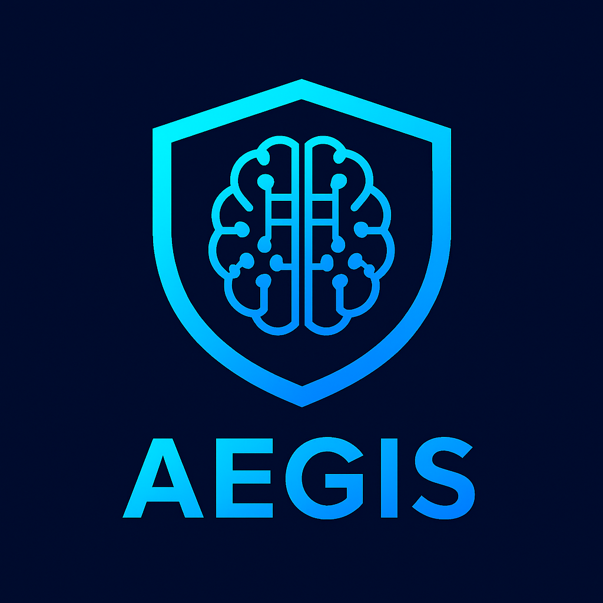

# 🛡️ Aegis Bot

**Aegis** is an **AI-powered Discord moderation & assistant bot** built to keep communities safe, fair, and engaged.  
Developed and hosted by the **Aegis Team**, it combines **next-gen auto-moderation** with an **intelligent AI assistant** that helps both staff and members.

---

## ✨ Key Features

### 🔹 Moderation
- 🚫 **AI AutoMod** – Detects harassment, hate speech, spam, and NSFW (context-aware).  
- ⚡ **Smart Escalations** – Automatically warns, mutes, or bans repeat offenders.  
- 📂 **Evidence Packs** – Generates clean case files with message history & reasoning.  
- 🛑 **Raid Protection** – Auto-locks the server during suspicious activity.  

### 🤖 AI Assistant
- ❓ `/whydeleted` – Explains why a message was removed.  
- 📖 `/ask` – Answers rule-related or FAQ questions instantly.  
- 🕵️ `/analyze` – Helps moderators decide if content breaks rules.  
- 📝 `/report` – Summarizes user reports and suggests actions.  

### ⚙️ Utility
- 🔧 Configurable settings to match your community’s needs.  
- 📜 User case history & infractions tracking.  
- 🗂️ Clean logging for all moderation actions.  

---

## 🚀 Getting Aegis

Aegis is **hosted by the Aegis Team** — no setup or coding required.  

👉 **[Invite Aegis to Your Server](https://your-invite-link-here.com)**  

Once added, you can immediately configure it with simple slash commands:  
/setrules – Upload your server rules  
/setlog – Define your moderation log channel  
/settings – Adjust automod preferences  

---

## 📸 Preview

*Always watching. Always protecting.*

---

## 📌 Roadmap

* [ ] AI-powered moderation (MVP)
* [ ] Rule-aware assistant (`/ask`, `/whydeleted`)
* [ ] Web dashboard for advanced configuration
* [ ] Multi-language support
* [ ] Premium tier with extended features

---

## 🤝 Support & Feedback

Need help? Have ideas?

* 📨 Join our **[Support Server](https://discord.gg/your-support-invite)**
* 🐛 Report bugs or request features via our issue tracker.

---

## 📜 License

Aegis is hosted and maintained by the **Aegis Team**.
All rights reserved © 2025.
